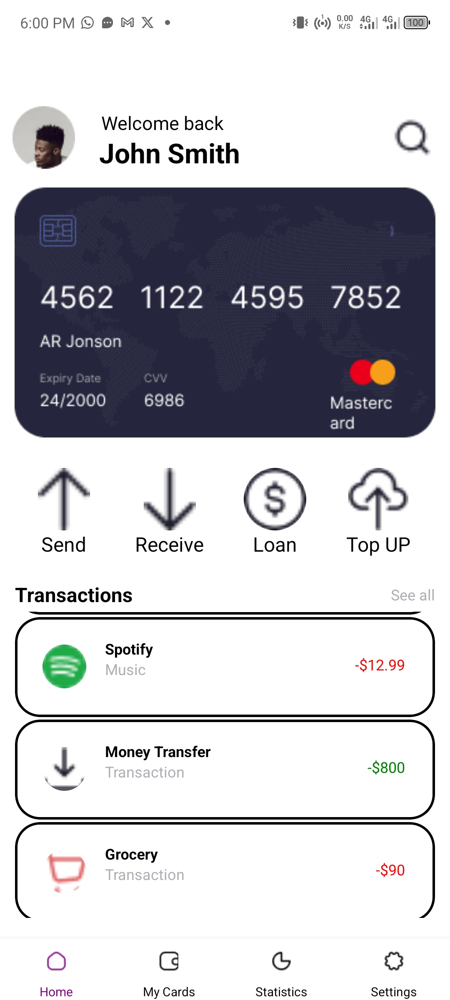
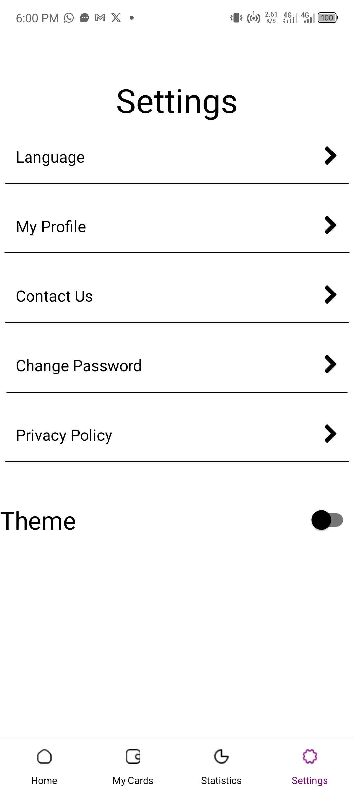
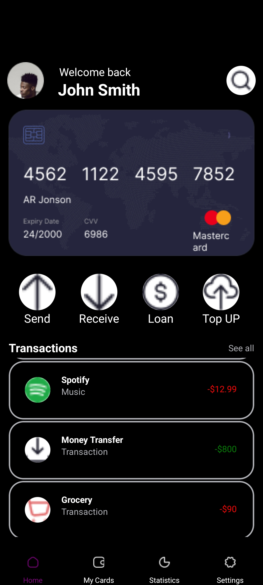
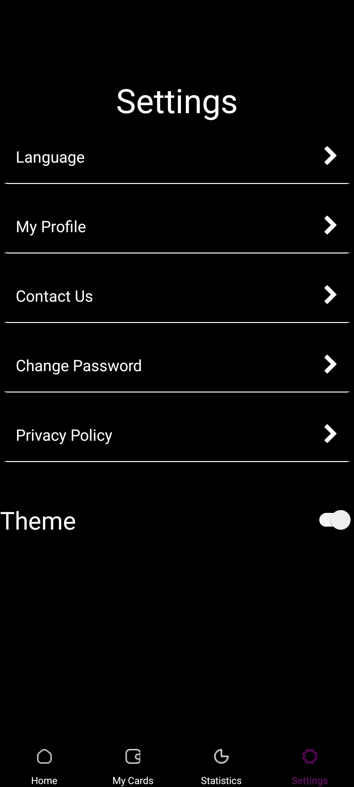

# rn-assignment5-11282821

# Mobile Wallet App

A React Native application designed to manage and track your transactions with ease. This app features a sleek user interface that supports both light and dark themes, providing a comfortable viewing experience for users at any time of the day. Navigate through your transactions, manage cards, and view statistics with just a few taps.

## Features

- **Dynamic Theming:** Supports light and dark themes to suit your preference or time of day.
- **Customizable User Interface:** Personalize your experience with customizable themes and settings.
- **Easy Navigation:** Utilize the bottom tab navigator to switch between screens effortlessly.

## Installation

To run this project, you'll need to have Node.js installed on your computer. After cloning the repository, navigate to the project directory and run:

To install the application, follow these steps:

1. Clone the repository: `git clone https://github.com/yawadubempong/rn-assignment4-11282821.git`
2. Navigate to the project directory: `cd rn-assignment4-11282821/finance`
3. Install the dependencies: `npm install`

## Running the Application

To run the application, use the command: `npm start`

## Custom Components

In the `Home.js` file of our React Native project, we utilize a variety of custom components to build a user-friendly home screen interface. Here's a brief overview of each component used:

### 1. `Header`
- **Description:** Displays a welcoming message along with the user's name. It's designed to be reusable across different screens where a header is needed.
- **Props:**
  - `title`: String - The welcoming message to be displayed.
  - `name`: String - The name of the user to be displayed.
  - `color`: String - The color of the text, which changes based on the selected theme.

### 2. `Transactions`
- **Description:** A component that lists all the transactions made by the user. It uses a `FlatList` to efficiently display a potentially large list of transactions.
- **Props:**
  - `transactions`: Array - An array of transaction objects to be displayed.
  - `color`: String - The color of the text, which changes based on the selected theme.

### 3. `ThemeContext`
- **Description:** Not a visual component, but a context used to manage and provide the current theme (light or dark) to the components. This allows for dynamic theming across the app.
- **Usage:**
  - This context is used in the `HomeScreen` component to apply the current theme's background and text colors to the styles.

### Custom Elements within `HomeScreen`
- **Options Display:** A `FlatList` is used to render a horizontal list of options like "Send", "Receive", "Loan", and "Top UP". Each option is represented with an icon and a description.
- **Transaction List:** The `Transactions` component is passed a list of transactions to display. Each transaction includes details like category, amount, and company.

These components and elements work together to create a cohesive and dynamic user interface that adapts to the user's theme preferences, enhancing the overall user experience.

## Screenshots

### Light Theme

| Home Screen | Settings Screen |
|-------------|---------------------|
|  |  |

### Dark Theme

| Home Screen | Settings Screen |
|-------------|---------------------|
|  |  |
